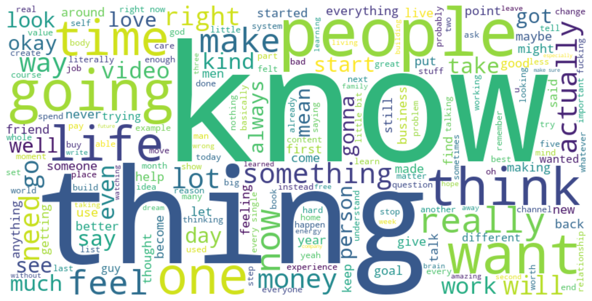
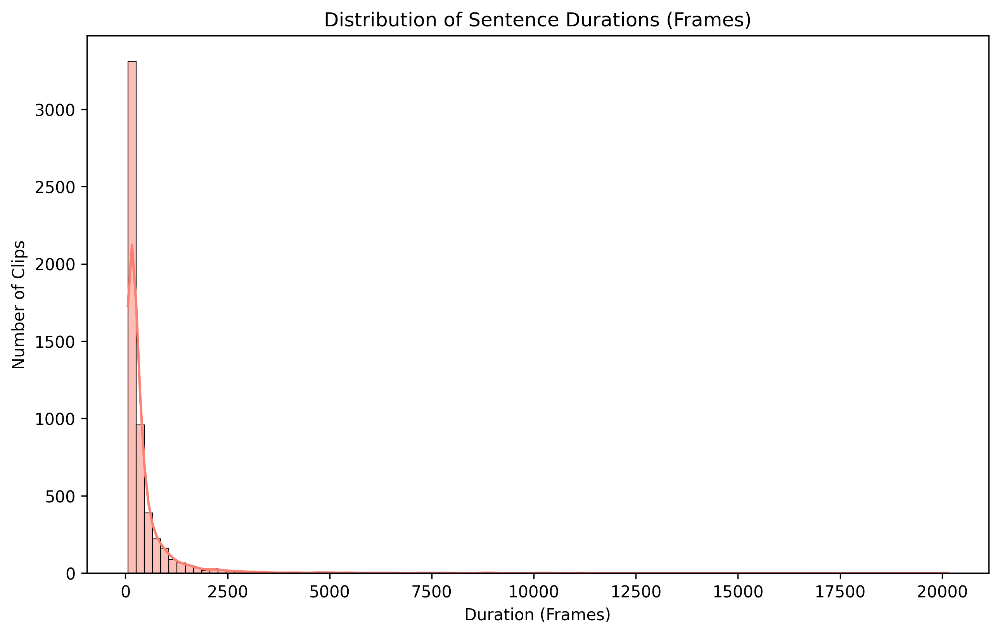
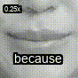

# ⚙️ Data Pipeline

This directory contains the core automated pipeline for crate the dataset for this project. The pipeline is responsible for transforming raw YouTube videos into a high-quality, machine-learning-ready dataset of isolated lip sequences and corresponding text labels.
The process is fully automated, highly parallelized, and specifically designed for videos featuring a single person speaking directly to the camera, while remaining robust enough to automatically filter out visual noise, background distractions, and irrelevant video segments.

---

## 📜 Pipeline Stages Breakdown

### `main.py` (The Orchestrator)
**What it does:** Serves as the central execution hub for the entire pipeline. It sequentially triggers all processing stages and automatically bypasses previously completed videos or stages to save compute time.

### `01_downloader.py`
**What it does:** Securely downloads raw video files from YouTube based on the provided URL configuration list.
**Tools Used:** `yt-dlp`, `FFmpeg`, `Node.js`.
**How it works:** It circumvents platform protections using client spoofing and browser cookies, then standardizes the downloaded video resolution and frame rate using hardware acceleration.
**Hyperparameters:**
* `TARGET_HEIGHT`: Standardized to `1080p`.
* `TARGET_FPS`: Standardized to `25 fps`.
* `MAX_WORKERS`: Defines parallel download threads.

### `02_transcriber.py`
**What it does:** Extracts audio from the raw videos, transcribes the speech to text, and creates highly accurate word-level timestamps while identifying distinct speakers.
**Tools Used:** `WhisperX` (Large-v3 model), `Pyannote` (Speaker Diarization), `PyTorch`.
**How it works:** It first runs Voice Activity Detection (VAD) to filter out silence. Then, it transcribes the active audio using Whisper and aligns the text to exact audio frames. Finally, it uses diarization to map each spoken word to a specific speaker ID.
**Hyperparameters:**
* `COMPUTE_TYPE`: Set to `float16` for optimal GPU memory usage.
* `BATCH_SIZE`: Adjusted based on available GPU VRAM.

### `03_analyze_video.py`
**What it does:** Performs deep spatial analysis on every individual frame of the raw videos to extract facial landmarks and determine if the head pose and face visibility are suitable for lip-reading.
**Tools Used:** `MediaPipe Face Mesh`, `OpenCV`, `multiprocessing`.
**How it works:** It calculates the 3D head pose and overall face tracking stability. It flags frames as "valid" or "invalid" based on strict angular and movement thresholds, generating a detailed JSON mapping the exact lip coordinates for valid frames.
**Hyperparameters:**
* `MIN_FACE_RATIO` (`0.1`): Minimum required ratio of the face size relative to the entire frame.
* `YAW_THRESHOLD_MIN` (`0.15`) / `YAW_THRESHOLD_MAX` (`6.67`): Acceptable left/right head rotation limits.
* `PITCH_THRESHOLD_UP` (`0.62`) / `PITCH_THRESHOLD_DOWN` (`0.13`): Acceptable up/down head tilt limits.
* `MOVEMENT_THRESHOLD` (`0.10`): Maximum allowed face movement between consecutive frames.
* `YAW_THRESHOLD` (`0.45`): Maximum allowed yaw shift between consecutive frames.
* `SIZE_THRESHOLD` (`0.15`): Maximum allowed change in face bounding box size between frames.

### `04_extract_clips.py`
**What it does:** Fuses the valid temporal windows (from Step 03) with the transcribed sentence timestamps (from Step 02) to crop out high-quality speaking segments.
**Tools Used:** `FFmpeg`, `JSON/Pandas`.
**How it works:** It finds intersections where a spoken sentence aligns with a continuous sequence of valid frames, slicing the raw video into shorter `.mp4` files containing only perfect sentence-level segments.
**Hyperparameters:**
* `SMOOTHING_TOLERANCE` (`3`): Number of invalid frames allowed to be ignored/bridged over within a continuous valid segment.
* `MAX_INTERNAL_SILENCE_SEC` (`2`): Maximum allowed silence duration within a single clip before it forces a split.
* `PADDING_SEC` (`0.5`): Extra time added before and after the speech segment to provide visual context.
* `MIN_CLIP_DURATION_SEC` (`3.0`): The absolute minimum length required to save a clip.

### `05_cut_lips.py`
**What it does:** Performs precise spatial cropping on the generated clips to isolate strictly the speaker's lip region.
**Tools Used:** `OpenCV`, `NumPy`.
**How it works:** It dynamically calculates a tight bounding box around the mouth based on MediaPipe landmarks. This calculation accurately accounts for the mouth's physical angle and rotation. If a frame in the middle of a valid sequence is missing facial landmarks, the script applies linear interpolation to flawlessly fill in the missing bounding box coordinates between the known frames.
**Hyperparameters:**
* `DATA_GRAYSCALE`: Boolean flag determining whether the output lip videos are saved in Grayscale or RGB color.
* `CROP_SIZE`: The strict output resolution for the model (e.g., `88x88` or `96x96` pixels).

### `06_create_single_word_dataset.py`
**What it does:** Further refines the dataset by breaking down the sentence-level lip videos into isolated, single-word lip videos.
**Tools Used:** `FFmpeg` / `OpenCV`.
**How it works:** Utilizing the precise word-level timestamps generated by WhisperX, it slices the cropped lip videos into micro-segments representing exactly one spoken word, paired with a JSON label.
**Hyperparameters:**
* `WORD_PADDING`: Specific temporal padding (in  frames) added around the exact boundaries of the word to provide contextual visual cues before the lips move.

### `07_generate_statistics.py`
**What it does:** Analyzes the final datasets to generate visual metrics, reports, and representative visual examples.
**Tools Used:** `Matplotlib`, `Seaborn`, `Pandas`, `OpenCV`.
**How it works:** It calculates total dataset duration, word frequency distributions, and average clip lengths, outputting these as `.png` charts. Additionally, it compiles sample highlight videos to visually demonstrate the quality and structure of the final dataset.

---

## Frame Analysis Demonstration

This is a demonstration of the frame validation process (executed in Step 03). The algorithm analyzes each frame to determine data viability:
* 🟢 **Green Bounding Box:** Frame is valid (Single face detected, optimal head pose, clear lip visibility).
* 🔴 **Red Bounding Box:** Frame is invalid (Extreme pitch/yaw, multiple faces, or occlusions).
(This is the beginning of a complete video for example and 720 quality instead of 1080 for uploading to git)

---

## Data Sample Outputs

*Below are representative examples of the visualizations and data clips produced during the statistics phase (Step 07) to illustrate the final dataset quality.*

### 📈 Statistical Insights
| Vocabulary Overview | Sequence Distribution |
|:---:|:---:|
|  |  |
| *Top occurring words in the dataset* | *Analysis of clip lengths (seconds)* |

### 🎞️ Processed Data Samples
* **Automated Lip-Sync & Crop (Side-by-Side):** Demonstrates the synchronized tracking of facial landmarks compared to the stabilized, isolated lip-region output.

* **Isolated Word Extraction:** A micro-clip of a single word ("Example 1") precisely sliced from a sentence based on WhisperX alignment.

